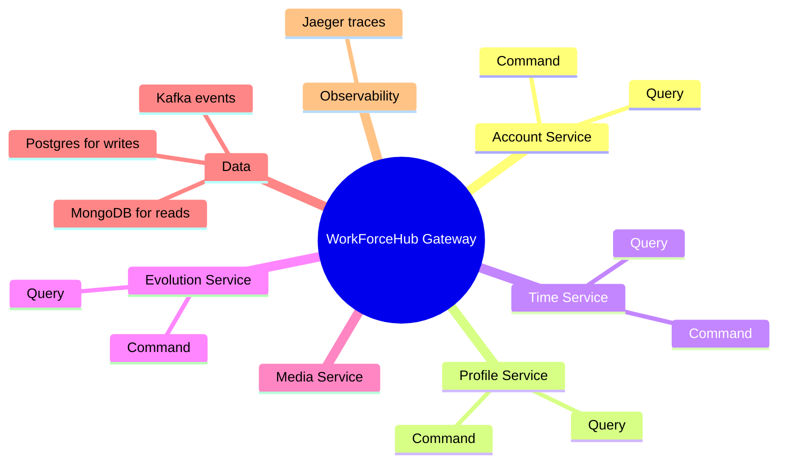

# WorkForceHub

WorkForceHub is a microservices-based HR management backend. The gateway is the single entry point, then it routes requests to the right command or query service.

## Architecture



## What the Jaeger Graph Means

The Jaeger image shows the live service calls. `WorkForceHub.Gateway` is in the middle because all API requests pass through it first.

The gateway then calls the command services for writes and the query services for reads:

- Command services change data and publish events.
- Query services read optimized data from MongoDB.
- Kafka connects writes to read-model updates.
- Jaeger records the traces so you can see which services are being called.

The numbers on the arrows are request counts captured by Jaeger.

## Getting Started

### Prerequisites

1. **Install the .NET 10 SDK**

   Confirm it is available with `dotnet --version`.

2. **Install Docker Desktop and Docker Compose**

   Download Docker Desktop from [docker.com](https://www.docker.com) and make sure the Docker engine is running.

3. **Install `make`**

   The commands below use the repository's `Makefile` to start the correct Compose project and initialize all four write databases.

4. **Generate local environment variables**

   ```powershell
   make generate-local-env
   ```

   Skip this command if `.env` already exists. AppHost reads the local database credentials and service secrets from this file.

### Running the System Locally

#### Option 1: Minimal Stack (Infrastructure + Observability)

Use this option when running the .NET services through Aspire AppHost. The minimal profile starts PostgreSQL, MongoDB, Kafka, Jaeger, Prometheus, and the administration tools, but does not start duplicate service containers.

```bash
make up-min
```

`make up-min` also creates the `account_write`, `profile_write`, `time_write`, and `evolution_write` PostgreSQL databases. Wait until the infrastructure is healthy before starting AppHost:

```bash
docker compose -p workforcehub -f docker-compose.yml --profile minimal ps
```

The local services use these infrastructure endpoints:

- **PostgreSQL**: `localhost:55433`
- **MongoDB**: `localhost:27017`
- **Kafka**: `localhost:29092`

Infrastructure and observability UIs:

- **Jaeger** (Distributed Tracing): http://localhost:16686
- **Prometheus** (Metrics): http://localhost:9090
- **Kafka UI**: http://localhost:8090
- **Adminer** (Postgres UI): http://localhost:8080
- **Mongo Express** (MongoDB UI): http://localhost:8081

Then launch all services locally using the AppHost:

**In Visual Studio**: Set `WorkForceHub.AppHost` as the startup project, then run it with F5 or the Run button.

**Or via CLI**:

```bash
dotnet run --project WorkForceHub.AppHost/WorkForceHub.AppHost.csproj
```

AppHost reads `.env`, supplies each command service with its PostgreSQL connection string, supplies each query service with its MongoDB connection string, and configures Kafka at `localhost:29092`.

After the Aspire Dashboard shows the Gateway and all services as **Running**, open:

- **Gateway health**: http://localhost:5240/health
- **Unified Swagger UI**: http://localhost:5240/swagger/index.html
- **Unified OpenAPI document**: http://localhost:5240/gateway-docs/v1/openapi.json
- **Aspire Dashboard**: use the URL printed by AppHost in the console

All traces will be visible in Jaeger at http://localhost:16686

If a command service reports `The ConnectionString property has not been initialized`, confirm that `.env` exists, the minimal profile is running, and AppHost was restarted after configuration changes. If Swagger keeps loading, check the Aspire Dashboard for a command/query service that failed to start.

#### Option 2: Full Stack (All Services + Observability)
This runs everything including all microservices, Gateway, Jaeger for distributed tracing, and Prometheus for metrics.

```bash
make up
```

Once running, access all URLs:

- **Gateway**: http://localhost:5000
- **Swagger UI**: http://localhost:5000/swagger/index.html
- **Jaeger** (Distributed Tracing): http://localhost:16686
- **Prometheus** (Metrics): http://localhost:9090
- **Kafka UI**: http://localhost:8090
- **Adminer** (Postgres UI): http://localhost:8080
- **Mongo Express** (MongoDB UI): http://localhost:8081

### Monitoring Your Setup

When running `make up-min` or `make up`, Jaeger shows live service calls in real-time. The minimal stack is perfect for running services locally in Visual Studio and viewing their traces in Jaeger.

In the full stack, `WorkForceHub.Gateway` is in the center of the trace graph because all API requests pass through it first. The gateway then routes to appropriate command services (for writes) or query services (for reads). Kafka publishes events that trigger read-model updates in MongoDB.

### Stopping the System

```bash
make down
```

### Cleaning Up (Remove All Data)

```bash
make clean
```

### Resetting Databases

```bash
make reset-dbs
```

## Local URLs

### Minimal Stack + AppHost (`make up-min` + `dotnet run WorkForceHub.AppHost`)

- **Gateway**: `http://localhost:5240`
- **Gateway health**: `http://localhost:5240/health`
- **Unified Swagger**: `http://localhost:5240/swagger/index.html`
- **Unified OpenAPI document**: `http://localhost:5240/gateway-docs/v1/openapi.json`
- **Aspire Dashboard**: use the URL printed in the AppHost console
- **Jaeger** (Distributed Tracing): `http://localhost:16686`
- **Prometheus** (Metrics): `http://localhost:9090`
- **Kafka UI**: `http://localhost:8090`
- **Adminer** (Postgres): `http://localhost:8080`
- **Mongo Express** (MongoDB): `http://localhost:8081`

### Full Stack (`make up`)

- **Gateway**: `http://localhost:5000`
- **Swagger**: `http://localhost:5000/swagger/index.html`
- **Jaeger** (Distributed Tracing): `http://localhost:16686`
- **Prometheus** (Metrics): `http://localhost:9090`
- **Kafka UI**: `http://localhost:8090`
- **Adminer** (Postgres): `http://localhost:8080`
- **Mongo Express** (MongoDB): `http://localhost:8081`
