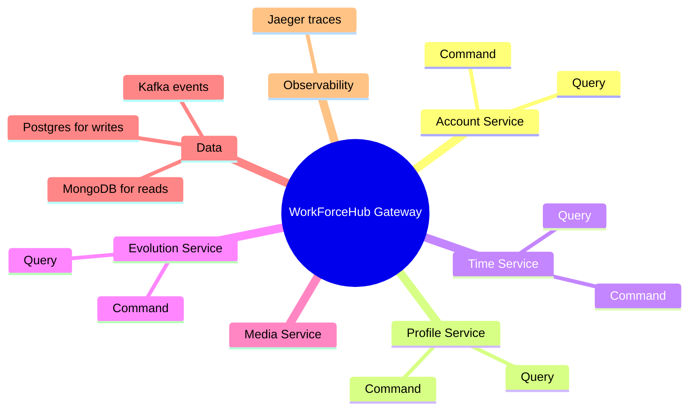

# WorkForceHub

WorkForceHub is a microservices-based HR management backend. The gateway is the single entry point, then it routes requests to the right command or query service.

## Architecture

## What the Jaeger Graph Means

The Jaeger image shows the live service calls. `WorkForceHub.Gateway` is in the middle because all API requests pass through it first.

The gateway then calls the command services for writes and the query services for reads:

- Command services change data and publish events.
- Query services read optimized data from MongoDB.
- Kafka connects writes to read-model updates.
- Jaeger records the traces so you can see which services are being called.

The numbers on the arrows are request counts captured by Jaeger.

## Local URLs

- Gateway: `http://localhost:5000`
- Swagger: `http://localhost:5000/swagger`
- Jaeger: `http://localhost:16686`
- Kafka UI: `http://localhost:8090`
